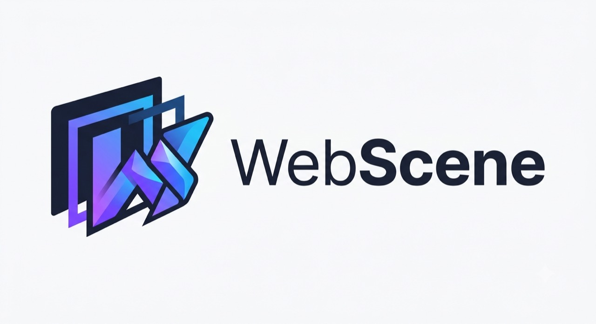
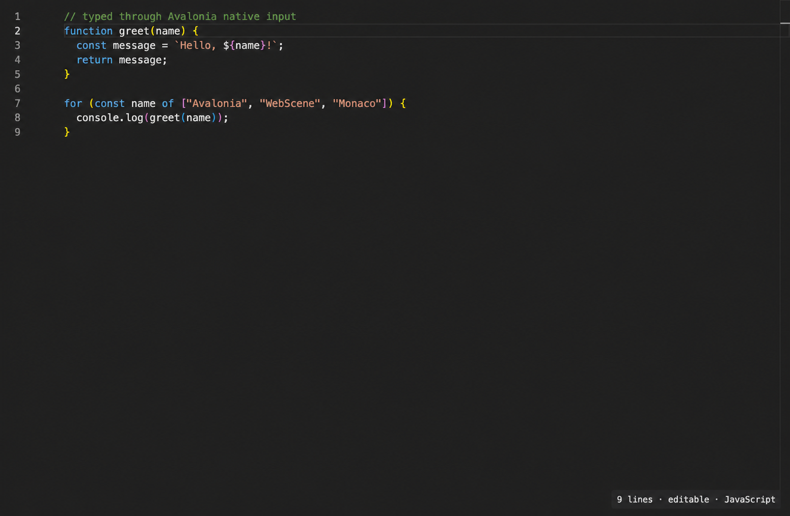
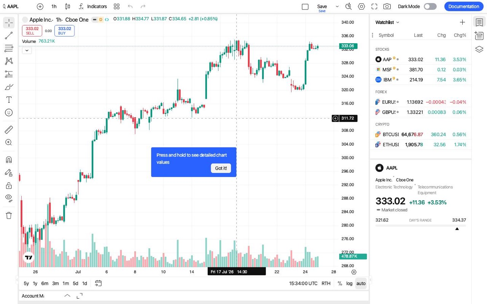

<p align="center">
  
</p>

# WebScene

WebScene is a native web-UI runtime for trusted, packaged content in .NET applications.
It runs JavaScript in V8, implements a deliberately bounded DOM/CSS/layout/Canvas/SVG
platform, and publishes immutable scene updates to native host presenters.

It is not a browser, WebView, Chromium shell, or implementation of the full web platform.
The intended use is controlled UI that an application owns, tests, and ships: charts,
dashboards, editors, diagramming surfaces, kiosks, and JavaScript UI plug-ins.

## Why WebScene

- Hot DOM, CSS, layout, Canvas, SVG, and JavaScript work stays inside one native runtime.
- The application UI thread consumes immutable scene state instead of servicing
  fine-grained JavaScript-to-.NET calls.
- Web-authored surfaces compose inside native application windows and lifecycle.
- Host capabilities are explicit and can be exposed through typed TypeScript-to-.NET
  interop rather than a browser-wide bridge.
- Dedicated native V8 isolates expose raw debugging domains plus native
  DOM/CSS/Overlay element inspection through an optional Chrome discovery host;
  see [V8 Inspector debugging](docs/v8-inspector-debugging.md).
- Compatibility is stated as a versioned component profile and measured with a curated
  WPT subset plus product-scale fixtures.

The project has one engine: the native V8 scene engine. The former managed
ClearScript/Avalonia engine, its fallback behavior, packages, templates, and samples have
been removed.

## Current status

WebScene is pre-production. The native architecture, runtime packages, deterministic
test runner, Avalonia presenter, Uno proof, typed interop generator, and substantial
Canvas/SVG/component workloads exist. Compatibility and packaging are advancing, but
arbitrary websites and arbitrary React applications are not supported.

Autonomous Custom Elements now have a candidate compatibility slice: registry
definition and lookup, parser and programmatic upgrade, `HTMLElement` subclass
construction, observed-attribute reactions, and connected/disconnected callbacks.
The first Shadow DOM slice adds native open/closed root ownership, `attachShadow()`,
default and named slot distribution, scoped shadow styles, host-value inheritance, and
one composed projection for layout, paint, hit testing, focus, and event paths. This is
component-enabling candidate coverage, not a complete Web Components claim. Flattened
or manual slots, `slotchange`, declarative Shadow DOM, `adoptedStyleSheets`, `::part`,
`::slotted`, complete focus delegation and retargeting, customized built-ins, adopted
callbacks across document realms, ES module graphs, and the complete custom-element
reaction queue remain outside the supported profile.

Current reference applications include:

- `samples/NativeRuntimeShowcase.Avalonia` — native runtime and scene presentation;
- `samples/NativeMonacoEditor` — a demanding editor workload;
- `samples/NativeTradingViewTerminal` — a Canvas/SVG-heavy application workload;
- `samples/NativeRuntimeShowcase.Uno` — a second-host proof.

Avalonia is the reference presenter. Uno is a proof, not yet a production-ready
drop-in backend. WPF, WinUI, Flutter, and other presenter integrations are roadmap work
and should not be presented as currently supported products.

## Native runtime workloads

These reference applications run existing web workloads through the native V8 scene
engine and native presenter, without an embedded WebView or browser surface.

<table>
  <tr>
    <td width="50%">
      
    </td>
    <td width="50%">
      
    </td>
  </tr>
  <tr>
    <td align="center"><strong>Monaco Editor</strong><br><sub>Native text layout, syntax highlighting, editing, selection, and folding</sub></td>
    <td align="center"><strong>TradingView terminal</strong><br><sub>Live charts, WebSockets, nested frames, toolbars, and interaction</sub></td>
  </tr>
</table>

See the [Native Monaco editor sample](samples/NativeMonacoEditor/README.md) and
[Native TradingView terminal sample](samples/NativeTradingViewTerminal/README.md)
for build, run, and headless-proof instructions.

## Architecture

```text
trusted HTML/CSS/JavaScript
            |
            v
native engine thread
V8 + DOM + CSS + layout + events + Canvas/SVG
            |
            v
immutable, reference-counted scene diffs
            |
            +----> Avalonia presenter
            +----> Uno proof
            +----> headless/conformance renderer
```

The engine owns live V8 and document state. Presenters never receive live DOM objects;
they traverse immutable scene tables and maintain renderer-side caches by resource
generation. Input, frame timestamps, evaluation requests, and resource operations cross
an ordered native boundary.

The native parser stack uses html5ever for HTML and Servo-derived CSS parsing and
selector matching. V8, ICU data, ABI metadata, licenses, and hashes ship in
RID-specific runtime packages.

See [the native engine design](docs/architecture/native-v8-scene-engine.md) and
[backend status](docs/backends.md).

## Packages

The repository produces these .NET packages:

- `WebScene.Core`, `WebScene.Dom`, `WebScene.Css`, and `WebScene.Graphics` for
  portable contracts and supporting semantics;
- `WebScene.Backend.Abstractions`, `WebScene.Backend.Avalonia`, and
  `WebScene.Backend.Uno` for presenter contracts and integrations;
- `WebScene.JavaScript.Interop` and
  `WebScene.JavaScript.Interop.Generator` for typed host interop;
- `WebScene.Sdk` for component manifests, assets, lifecycle, and host-bridge
  contracts; and
- `WebScene` for the separate Avalonia HTML-inspired authoring layer.

The native engine is supplied by one matching RID package:

- `WebScene.NativeEngine.Runtime.osx-arm64`
- `WebScene.NativeEngine.Runtime.linux-x64`
- `WebScene.NativeEngine.Runtime.win-x64`

A reusable native `WebSceneComponentHost` package and application templates are not
currently published. Their reintroduction requires a native implementation; there is no
managed fallback.

See [the NuGet inventory](docs/nuget/README.md).

## Build

Requirements depend on the target. The .NET solution requires the SDK pinned in
`global.json`. Building the native runtime additionally requires CMake, a C++ toolchain,
Rust for the parser libraries, and the V8 build prerequisites described by the runtime
scripts.

```bash
dotnet restore WebScene.sln
dotnet build WebScene.sln -c Release --no-restore
dotnet test WebScene.sln -c Release --no-build
```

Build and verify the native runtime on a matching host:

```bash
scripts/build-native-engine-runtime.sh --rid osx-arm64
scripts/build-native-engine-runtime.sh --rid linux-x64
```

Published production packages use the patched V8 SDK and include Chrome/CDP
debugging. Normal engine instances retain only the small atomic capability and
lazy-state pointers; Inspector objects, sessions, mutexes, queues, callbacks,
and managed registry state remain unallocated until a debugger connects. There
is no separate production runtime flavor without CDP support.

```powershell
./scripts/build-native-engine-runtime.ps1 -Rid win-x64
```

Run the Avalonia showcase with an explicit engine library:

```bash
dotnet run --project samples/NativeRuntimeShowcase.Avalonia -c Release -- \
  --native-library /absolute/path/to/libwebscene_native_engine.dylib
```

The same path can be supplied through `WEBSCENE_NATIVE_ENGINE_LIBRARY`.

## Compatibility

WebScene follows a bounded component profile rather than claiming browser conformance.
The profile contains required, candidate, harness-blocked, and explicitly excluded
tests. Required tests are release gates; broader candidate and upstream WPT exploration
are discovery signals.

List or run the native-only profile:

```bash
dotnet run --project tests/WebPlatformSubset/runner -c Release -- \
  --selection all --list

dotnet run --project tests/WebPlatformSubset/runner -c Release -- \
  --selection required \
  --native-library /absolute/path/to/libwebscene_native_engine.dylib
```

Pass `--chromium-path /absolute/path/to/chrome-or-chromium` to add non-gating
Chromium validation and cross-engine pixel metrics for static reftests. This supplements
the standard same-engine WPT comparison and can expose common-mode reference failures.

There is no engine selector and no fallback. A missing native capability is visible as a
native failure. See [the profile policy](tests/WebPlatformSubset/README.md).

## Roadmap

The priority order is:

1. Hold the required native compatibility profile on every released RID.
2. Harden the candidate Custom Elements and Shadow DOM slices against broader unchanged
   WPT and representative packaged components, promoting only behavior with complete
   cascade/layout/input/paint evidence.
3. Publish a reusable native Avalonia component host with resource loading, lifecycle,
   recovery, diagnostics, typed host calls, and multi-instance tests.
4. Complete IME, clipboard, accessibility/automation, focus, and debugging contracts.
5. Expand non-gating WPT discovery and promote valuable browser behavior into the
   bounded release profile.
6. Stabilize the presenter SDK, then promote additional hosts only with their own
   conformance and product-workload evidence.

The strategic target is valuable trusted web-authored UI inside native applications,
not a general browser and not blanket website compatibility.

## Repository map

| Path | Purpose |
| --- | --- |
| `experiments/WebScene.NativeEngine.Probe` | Native V8/DOM/CSS/layout/scene engine and C ABI |
| `src/WebScene.Backend.Avalonia` | Avalonia presenter and native scene integration |
| `src/WebScene.Backend.Uno` | Uno presenter proof |
| `src/WebScene.*` | Portable contracts, semantics, SDK, and typed interop |
| `packaging/WebScene.NativeEngine.Runtime` | RID runtime packaging |
| `tests/WebPlatformSubset` | Native-only component profile and WPT runner |
| `samples/Native*` | Native runtime reference workloads |
| `third-party/v8` | Pinned V8 source submodule |
| `third-party/v8-patches` | Native-owned V8/build/ICU patches |

## Security boundary

WebScene currently targets trusted application content. It does not provide a
browser-grade origin, permission, navigation, or process sandbox. Do not treat it as a
safe renderer for arbitrary untrusted websites or scripts.

## License

The repository uses the terms in [LICENSE](LICENSE), including its Restricted Party
Clause. Describe it as a custom source-available license, not unqualified MIT or an
OSI-approved open-source license.
