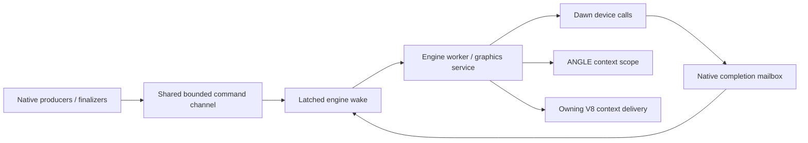

# G02 completion scheduling and native mapping evidence

This is partial evidence for issue #24, not completion of G02 or epic #22.

On macOS ARM64 (Apple M4), the graphics-enabled V8 build passed all 12 CTests
in 13.51 seconds after adding pending-operation scheduling. After adding the
native mapping cases, all eight graphics CTests passed in 0.47 seconds.

Commands:

```sh
cmake --build artifacts/graphics-build/native-v8-enabled --parallel 4
ctest --test-dir artifacts/graphics-build/native-v8-enabled --output-on-failure
ctest --test-dir artifacts/graphics-build/native-v8-enabled -R graphics --output-on-failure
```

The completion mailbox tracks pending reservations under its existing mutex.
Publishing or cancelling a pending slot removes it from the pending count;
ready records retain their bounded slot until engine-thread delivery. An idle
Dawn instance with no pending operations does not force a periodic worker wake.
Outstanding operations retain the one-millisecond ProcessEvents polling bound.
Ready cancellation records request immediate delivery even after service close.
Future device-loss notifications must use an explicit event/wake strategy;
this does not qualify idle behavior of future persistent notification bindings.

The hardware Dawn test requests a native hardware adapter/device and submits a
real command buffer. It also maps a 4096-byte buffer without RAF or a presenter,
checks its initialized contents, then separately destroys a buffer immediately
after MapAsync and before ProcessEvents. The latter must deliver Aborted, and
both paths leave no pending or ready mailbox records. This readback is an API
mapping test, not a presentation path or a claim of zero-copy composition.

The V8 task path explicitly enters the owning context for graphics delivery and
runs a microtask checkpoint when completions are delivered. Initialization
rejects a different runtime thread. The existing runtime suite passes, but no
JavaScript WebGPU binding exists yet to prove end-to-end promise dispatch.

Still outstanding: full native device/resource management and queue integration,
navigation and promise cancellation integration, finalizer release routing,
device loss, multi-engine stress, detailed diagnostics and performance gates,
and Windows/Linux hardware evidence. No issue is closed by these results.

## Native device ownership follow-up

The graphics service now owns generation-bearing Dawn device handles. Each
native device wrapper retains its adapter and device, creates a distinct device
owner identity, and closes on its engine thread. Destroy cancels that owner's
mailbox records before calling native Device.Destroy. The registry rejects
foreign-engine and stale handles and disallows destruction during an active
device execution scope. The internal adoption hook requires a freshly requested
device from this service's instance, supplied once with its originating adapter;
it is not a JavaScript-facing arbitrary device import API.

The extended hardware test destroys an owned device while MapAsync is pending.
Its cancellation record is delivered once, the actual late native callback runs
but cannot republish, and a separate owner's mailbox record remains successful.
This proves mailbox isolation, not yet two independent hardware devices under
load. The full suite passed 12 tests in 12.75 seconds, followed by eight graphics
tests after adding the pending-device-map case. Backend resource retention is
still distinct from submission-table fence completion; the device owner does
not substitute Destroy for a GPU completion fence.

## Two-device hardware isolation and completion diagnostics

The hardware test now requests two distinct adapters and creates one device
from each. Dawn consumes an adapter on successful device creation, so reusing
the first adapter is deliberately avoided. Both devices are owned by one
engine service with different device identities. After destroying the first
with a pending map, the surviving device uploads 4096 bytes and maps them
successfully. The CPU upload array is overwritten immediately after WriteBuffer;
every mapped word must retain the original pattern. Both device handles are
then destroyed, leaving zero live service devices and no pending/ready records.
This qualifies the native Dawn call-time upload behavior, not yet a JavaScript
typed-array detachment path or the future native command queue.

Completion snapshots report pending/ready counts, high-water storage occupancy,
admitted/delivered records, saturated reservations and rejected publications.
Admission-to-delivery latency samples, total and maximum nanoseconds are opt-in;
default operation does not read the clock for this instrumentation. The service
exposes completion snapshots alongside live native device/context counts and
propagates its timing option through lazy Dawn initialization. Work-queue byte
and presenter copy/readback counters still require later integration.

The completion unit test checks counters across saturation, cancellation,
duplicate publication and slot reuse, with timing disabled and enabled. It also
passes under Clang ThreadSanitizer using `-fsanitize=thread -pthread`.

## Bounded command channel integration



The channel retains no engine pointer. Native producers enqueue static noexcept
dispatch functions, fixed-size value/handle arguments and copied upload bytes.
Only the graphics service can consume or close the channel. It drains bounded
batches before native completion processing; queued work makes the existing
runtime readiness and idle-wait paths runnable. Shutdown closes admission and
drains all accepted commands before destroying devices/contexts. A retained
endpoint rejects admission after engine teardown. Framework Skia objects remain
outside this native execution scope and must stay on their presenter thread.

The ANGLE service test fills a two-slot queue from another thread, overwrites
the source data, verifies saturation without execution, then drains one command
at a time and checks the original red/blue GL state in FIFO order. It verifies
queue depth/high-water/copied-upload counters and execution of accepted work
during close. Another endpoint is retained across service destruction and must
return closed. The Dawn hardware test enqueues duplicate deferred device release
records from a finalizer-like thread: the device stays resident until the engine
pump, then releases once without a stale-handle failure.

These are native dispatch primitives, not completed JS binding integration.
Dispatchers must validate/report errors without throwing, retain referenced
resources as required by their backend operation and never capture borrowed V8
memory. Full queues require caller retention/retry, including finalizer releases;
actual V8 finalizer registration and that retry policy remain outstanding. The
command arena is lazy and fixed-capacity once created. GPU completion fences
still govern submitted resource lifetimes independently of command consumption.

## Cancellation versus native callback retirement

Logical cancellation no longer makes a completion slot immediately reusable.
Each reservation also tracks its one outstanding native publication. A cancelled
record can be delivered to the engine while its slot remains occupied until the
actual callback calls publish. That call retires the native operation, rejects
duplicate logical delivery and wakes capacity waiters. Generations cannot advance
while an old native operation still owns the slot. Metrics now expose native
pending and total occupied counts separately from logical pending/ready counts.

The open graphics service keeps its ProcessEvents polling demand while these
native callbacks are outstanding, even after all cancellation records are
consumed. Once the last native callback retires, idle polling stops. Reservation
callers must publish exactly once for native completion (or synchronous failure
before issuing the operation); cancellation is not a substitute for retirement.
Full-service shutdown still closes publication and destroys the native instance;
this change does not claim completed navigation/promise shutdown integration.

A capacity-one test cancels and drains a record, proves another reservation is
rejected until a delayed callback retires it on another thread, then reuses the
slot with a new generation and rejects the old callback. The service test checks
continued bounded polling followed by return to its normal idle wait. The real
pending-map destruction test uses service readiness/idle recommendations while
waiting for native retirement. All 12 local tests passed in 13.56 seconds; after
adding the scheduling assertions, all eight graphics tests passed in 0.43 seconds.
The completion test also passed with Clang ThreadSanitizer.

## V8 runtime completion integration test

A separate `webscene_graphics_v8_runtime_tests` executable compiles the production
engine source graph with its include paths, definitions, dependencies and
compiler/toolchain settings. It avoids exporting test hooks from the production
C ABI and is enabled only for graphics + V8 test builds.

On the runtime's owning worker thread, the fixture initializes V8, creates a JS
promise and schedules RAF, then hides the runtime. A separate native thread
publishes a completion record without entering V8. The normal runtime readiness
and task pump deliver the record; the dispatcher verifies the current isolate,
context and thread, resolves the promise, and the runtime checkpoint runs its
continuation while RAF remains unexecuted. A second case publishes a record and
uses `execute()` to reach task draining after script execution, proving explicit
context entry works on that route too. Wrong-thread graphics initialization is
rejected and completion storage returns to zero occupied slots.

This closes the earlier lack of direct runtime pump evidence. It still does not
prove JavaScript WebGPU bindings, automatic binding-triggered initialization,
navigation cancellation or full device-loss promise behavior; those are not
implemented by the fixture. No adapter/hardware qualification is claimed by this
test, which uses a native completion record and a real V8 promise.

```sh
ctest --test-dir artifacts/graphics-build/native-v8-enabled -R graphics_v8_runtime --output-on-failure
```

## Top-level document navigation retirement

After a replacement document loads successfully, but before its location/content
is installed, the runtime retires the old graphics service inside the existing
V8 context scope. It detaches the service/dispatcher from the runtime, closes
native admission, drains cancellation records and performs a microtask checkpoint.
A transition guard rejects reentrant graphics initialization or navigation during
this delivery. The retired service stays alive until dispatch has finished; old
command endpoints and native publication remain closed after it is destroyed.
A failed document load leaves the existing graphics service intact.

The runtime fixture verifies a pending promise receives the cancellation outcome
before the new document takes effect, late publication is rejected, the old
command endpoint is closed, and new initialization creates a distinct graphics
identity. It also verifies reentrant initialization/navigation rejection. The
full 13-test local suite passed in 12.85 seconds before the final reentrancy
assertion; the focused runtime test is rerun after that assertion.

This covers top-level load_url navigation with the native completion dispatcher.
Iframe-specific ownership, JavaScript WebGPU promise/error types and explicit
engine-disposal promise sequencing remain separate outstanding work. The runtime
still reuses its existing top-level V8 context as before; this change retires its
graphics lifetime and does not claim a general navigation-context redesign.

## Normal engine disposal sequencing

The runtime exposes an engine-thread-only shutdown_graphics operation, called
by the worker's normal shutdown path before runtime reset. It permanently closes
graphics initialization, enters the owning isolate/context and reuses document
graphics retirement to deliver cancellation records and run a microtask
checkpoint before releasing the service. Repeated shutdown is harmless. A
transition guard rejects shutdown during cancellation delivery.

The V8 fixture creates another pending promise after navigation, calls shutdown,
verifies its cancellation dispatcher runs in the owning V8 context/thread, and
checks the continuation has run before context disposal. A late native
publication is rejected, and graphics reinitialization after shutdown fails.
The raw destructor remains a no-JS fallback for bootstrap/terminal-failure cleanup;
this does not claim graceful promise delivery after an unrecoverable runtime
failure. Actual WebGPU binding promise types and iframe resource ownership are
still outstanding.

## Reserved finalizer-release capacity

The native service now has a separate fixed-capacity release channel. A wrapper
must reserve a generation-bearing slot before it becomes GC-visible; if no slot
is available, wrapper creation must handle backpressure before exposing the
object. A finalizer publishes that existing slot without allocation or competing
for command-queue space. The record captures the accepted command prefix, and
the engine dispatches release only after that prefix has executed. Later queued
commands cannot indefinitely postpone an eligible release. This CPU execution
barrier does not substitute for GPU submission fences.

The channel retains native command/wake endpoints, not an engine pointer. Duplicate
and stale tickets are rejected. Shutdown closes publication, drains published
releases after accepted commands, and leaves unpublished registrations to the
service's owner-wide resource teardown. Registration occupancy is exposed in
service metrics. The older ordinary-command release helpers remain available;
GC bindings should use reserved slots to avoid retrying a full command queue.

The hardware service test reserves one slot, saturates a two-command queue,
publishes release from another thread, and verifies the context stays alive after
one command but is released after both. It checks duplicate/stale publication,
slot reuse and shutdown of an unpublished registration. All 13 local CTests
passed in 13.62 seconds. The service test also passed under Clang ThreadSanitizer;
Dawn/ANGLE SDK binaries themselves were not rebuilt with sanitizer instrumentation.
Actual V8 weak-handle registration is the next integration step, not claimed here.

## V8 weak-wrapper release registry

The binding utility `graphics/v8_release_registry.h` owns bounded weak wrapper
entries and reserves native release slots before registration succeeds. It follows
the pinned V8 15.3.10 weak-callback contract: the first pass resets the triggering
persistent handle and schedules a second pass; the second pass publishes native
release work without executing JavaScript or GPU APIs. The engine later drains
that release through the command-prefix barrier. Registry disposal in its owning
isolate scope resets remaining handles and publishes their reserved releases.

The real V8 runtime fixture registers an unreachable object, triggers collection
through notify_low_memory, verifies no native release ran inside GC, then pumps
the runtime and observes exactly one release and zero occupied release slots.
It verifies bounded wrapper registration, reuses the collected entry, and disposes
the registry while a new wrapper is still held by a local handle. That disposal
also queues release instead of executing it inline. The focused runtime test
passed in 0.58 seconds with both cases.

This utility is exercised with real V8 objects and native dispatch records. Future
WebGPU/WebGL bindings must own a registry, attach each resource wrapper before
exposure and dispose the registry in its isolate scope. Those browser API wrapper
classes are not introduced here. The explicit low-memory call is test stimulus,
not a new production GC policy.

## Failed resource insertion preserves ownership

Resource-table insertion now accepts an rvalue reference and transfers the
unique pointer only after thread/owner/capacity validation succeeds. A rejected
wrong-thread call previously destroyed its by-value argument during unwinding,
which could release a thread-confined native object on the wrong thread. Tests
now retain a named pointer across wrong-thread, wrong-owner and full-table
failures and verify successful insertion transfers it exactly once. The resource
test passed under AddressSanitizer and UndefinedBehaviorSanitizer.

The full local CTest run passed 12 of 13 tests, including every graphics test.
The existing native-engine DOM activation case failed with:
`duplicate activation was not coalesced while save was pending: {"activations":0,"requests":0,"pending":false,"label":"Save"}`.
An isolated rerun of webscene_native_engine_tests passed in 11.16 seconds.
This is an unresolved intermittent test failure, not a clean full-suite pass or
proof that its cause is unrelated. No test expectation was weakened.
