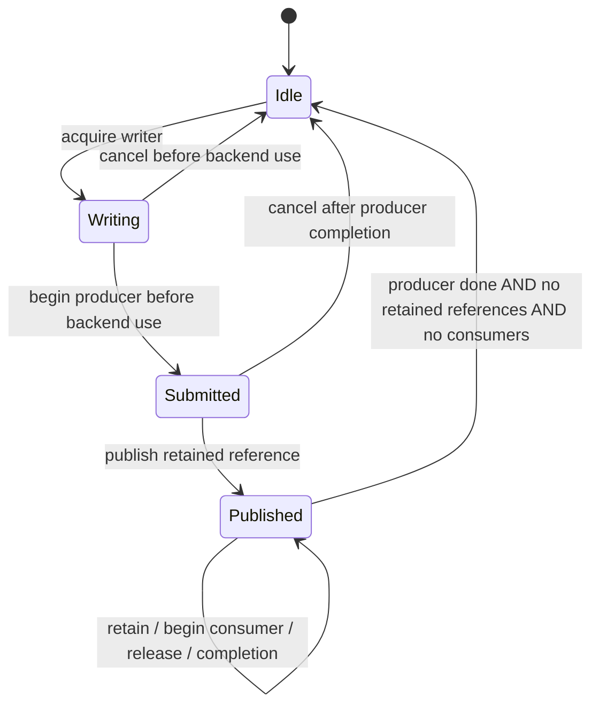

# GPU canvas lifetime implementation (G03 / issue #25)

Status: in progress. No GPU scene/lease ABI or production GPU presentation is
available yet. G01/G02 qualification and integration gaps remain open.

## Backing state

Every allocated canvas node now owns a stable backing identity. Context modes
are exclusive: none may become 2D, WebGL 1, WebGL 2 or WebGPU; requesting the same
mode is allowed, while switching modes is rejected. Existing 2D context creation
claims this mode. Unsupported browser context factories still return null without
claiming a mode. GPU factories are future binding work.

Backing state distinguishes bitmap dimensions, allocation generation and content
serial. Publishing content advances the content serial alone. A same-size bitmap
reset advances content but permits storage reuse; changed dimensions advance the
allocation generation as well. Mode and identity survive either reset. The
metadata owns no image allocation, pixels, native texture pointer or Skia object.

The native state test checks exclusive modes, distinct identities, 1,000 content
updates without an allocation-generation change, same-size reset, changed-size
reset and zero-sized bitmaps. This demonstrates metadata behavior, not actual
GPU allocation/copy counters. Canvas command appends and backing-store resets now publish content changes.
Initial 2D context creation synchronizes dimensions, and width/height property
resets update bitmap dimensions. Existing canvas command generations remain
unchanged while the lease API is implemented. General attribute mutation and
standards-level dimension normalization still need coverage.

## Remaining G03 integration

- Complete general attribute mutation and dimension-normalization coverage;
  connect backing versions to the new scene publication path.
- Extend the new v3 acquisition/capability envelope with GPU image lease
  records while preserving existing scene-view consumers.
- Carry opaque allocation identity, generation/content serial, format, alpha,
  color space, orientation and producer readiness in portable scene metadata.
- Implement explicit retained resource leases and consumer GPU completion.
  Scene acknowledgement must not release or recycle leased image storage.
- Bound active canvas presentation storage to three reusable color images, with
  backpressure for busy slots and retained old-generation leases on resize.
- Integrate GPU images into retained paint order, transforms, clips, opacity,
  isolation and damage; cover old consumers and stale-scene recovery.

Advancing a frame serial must never itself allocate an image or copy pixels.
GPU completion, scene retention and image reuse are separate lifetime conditions.

## Runtime backing-reset verification

The real V8 fixture draws into a 2D canvas and verifies content advances without
an allocation-generation change. CSS width changes preserve both bitmap content
and allocation generation. Resetting the width property to the same bitmap width
advances content while retaining identity/generation. Changing bitmap width to
640 advances allocation generation and updates dimensions while preserving 2D
context ownership. Dimension conversion for backing metadata checks finiteness
and bounds before integer conversion; it does not claim a redesign of existing
HTML attribute parsing/getter semantics.

The full 14-test local suite passed after the runtime wiring; the focused V8
fixture is rerun with the separate CSS-size assertion. These remain metadata and
2D recording checks, not proof of GPU pool allocation or zero-copy presentation.

## Bounded image lease state machine

`image_lease_pool` now implements the lifetime metadata for exactly three image
slots and a fixed-capacity ticket table (128 tickets by default). Each retained
reference and consumer GPU use receives a separate generation-bearing ticket;
duplicate release/completion cannot decrement another consumer's ownership.

Producer completion can arrive before CPU publication. Consumer registration can
precede producer completion, but the backend must enqueue the appropriate GPU
wait before sampling. No CPU wait is imposed by the metadata pool. Releasing a
scene/reference does not finish consumer work. Close stops new writers while
allowing existing retained images to be redrawn and their tickets completed.
Publish/retain/consumer admission returns backpressure when ticket storage is
full; image storage cannot grow beyond three slots.

The native test checks three-slot saturation, a retained reference independent
of the scene reference, two separate consumer tickets, cross-thread completion,
stale writer generations, duplicate/wrong-kind completions, close with retained
redraw, producer completion arriving last or before publication, and ticket-table
saturation/retry. The focused CTest and Clang ThreadSanitizer run both pass.

This class owns no GPU allocation and performs no pixel copy. Backend image
objects, versioned scene acquisition, opaque lease ABI, resize metadata and
presenter fence integration are still to be connected. Integration must keep the
pool and its native image owner alive until every outstanding ticket has retired;
the metadata class alone does not implement engine-detachment lifetime transfer.

## Immutable image metadata bound to leases

Each writer now supplies portable image metadata before publication: canvas and
allocation identities, allocation generation, content serial, dimensions, format,
alpha mode, color space, orientation and producer timeline/value. Invalid or
missing metadata is rejected. Publication freezes it for that image use; retained
and consumer lease tickets resolve the same metadata until released. A consumer
can still resolve its image after all scene references have been released.

The pool test keeps old-size and resized frames live concurrently, verifies each
lease retains its own dimensions/generation, and rejects mutation after publication,
foreign/stale lease lookup, zero dimensions and unknown formats. It passes under
ThreadSanitizer. These descriptors contain values only; native texture/Skia
pointers must remain in the backend provider's allocation registry. No native
image allocation or pixel copy is performed by descriptor publication/lookup.

This is the internal descriptor/lease association. C ABI versioning, native image
provider lookup, scene acquisition and actual resize allocation/fence integration
remain outstanding; no physical resize or zero-copy presentation pass is claimed.

## Active allocation aliasing and abandoned producers

Metadata binding now rejects an allocation identity already assigned to another
busy frame slot, even if its allocation-generation value differs. Re-presenting
unchanged pixels must retain the existing lease; it must not acquire a second
writer for the same physical image. The backend provider must also enforce its
allocation ownership across different pools.

A writer must explicitly begin producer work before backend submission and
publication. This freezes its metadata. Cancellation while producer work remains
pending is rejected; an abandoned frame can be cancelled once producer completion
arrives. Closing the pool does not silently recycle such a frame. Unsubmitted
writers remain cancellable without a GPU fence. Duplicate producer starts and
completion before a start are rejected.

The native fixture covers a busy-allocation alias across resized generations,
failed metadata mutation preserving the original descriptor, cancellation of an
in-flight producer, completion after close and final slot reclamation. Focused
CTest and ThreadSanitizer runs pass. These are lifetime protocol checks; physical
backend submission, memory accounting and scene ABI integration remain pending.

## Separately versioned scene acquisition

The C ABI now provides acquire_latest_scene_v3/acquire_next_scene_v3, explicit
acquisition statuses, version/size validation and consumer capability negotiation.
The v3 view currently wraps a borrowed CPU view with the unchanged v2 layout.
Callers release/acknowledge through the v3 functions; the borrowed CPU view must
not be released separately. Required scene capabilities are checked against the
consumer mask. Legacy acquisition refuses scenes requiring capabilities it cannot
represent. Current producers require zero capabilities; GPU image export is not
yet advertised or implemented by this envelope.

The native runtime fixture checks unsupported versions, short options, null
engines, ordered acquisition, legacy acquisition, v3 acknowledgement and retaining
the CPU view after engine destruction. All 15 local tests passed in 13.37 seconds.
The built macOS library exports all four new functions. A separate plain-C fixture
checks options/status sizes and view-field offsets without linking the engine.
GPU capability rejection with real GPU scenes, GPU lease operations, provider
lookup, managed consumers and Windows/Linux ABI/package verification remain open.

The plain-C fixture exposed a missing typedef for the existing interop callback
view; adding the forward typedef restores C compilation without changing layout.
The independent C layout test now passes.
