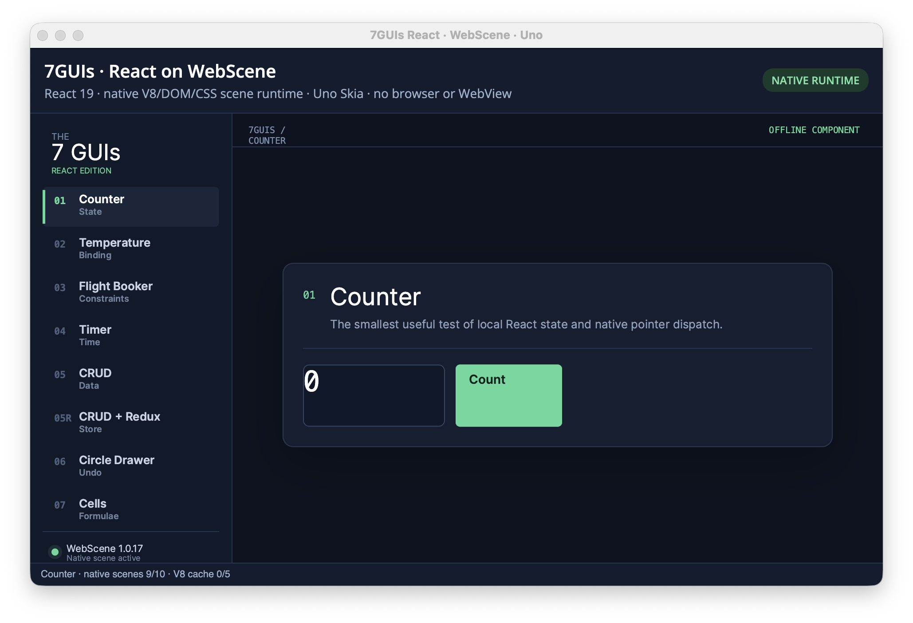
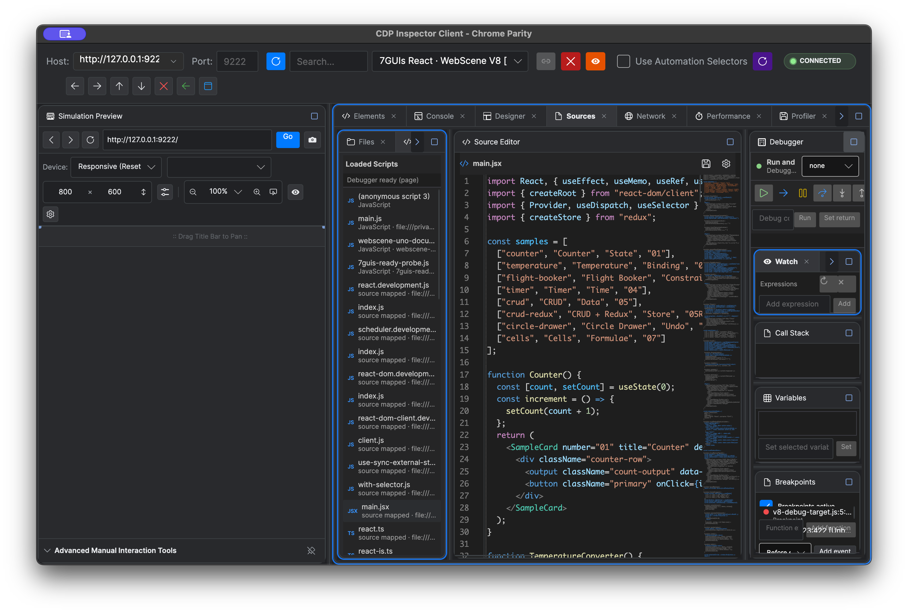
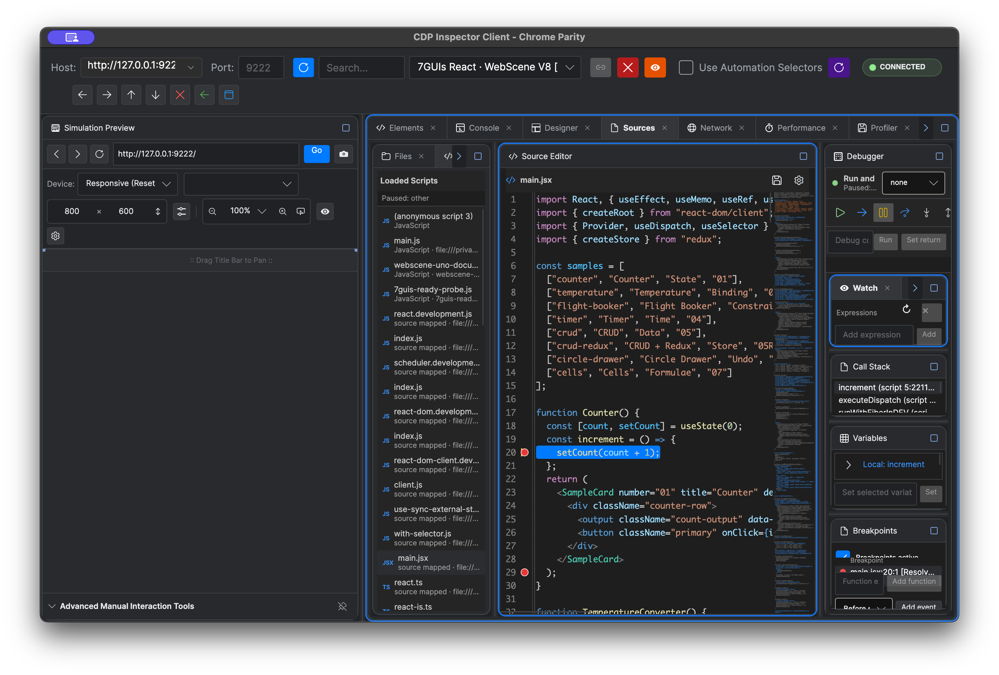

# 7GUIs React V8 Inspector validation

This record validates WebScene's diagnostic V8 runtime against the real
[`7guis-React` WebScene host](https://github.com/wieslawsoltes/7guis-React/tree/WebScene/WebSceneHost),
using the CDP Inspector application built from the merged V8 work in CDP.

## Versions

- WebScene: `3fcb5e8df1804fdcb278f258b15dce03c786a92b`
- 7GUIs React: `0091c0b2dd96f8eb50823d8cb9e23d1316ebb4e1`
- CDP Inspector: `edfc5953da2439b81255832b1ed34811b4424bea`
  (`0.1.0-preview.32` source)
- Platform: macOS arm64, Release configuration
- Diagnostic runtime SHA-256:
  `edec7efb211244a920ec5eb261174aac19c950a9d01a3303591e83884516f4c8`

## Session

1. Built the React application with its production Vite source maps.
2. Built and launched `WebSceneHost` in Release mode with the exact
   Inspector-enabled native runtime and `--webscene-inspect-brk=127.0.0.1:9229`.
3. Verified `/json/list` advertised `7GUIs React · WebScene V8`, its authenticated
   WebSocket URL, and a Chrome-compatible `devtoolsFrontendUrl`.
4. Connected the Release CDP Inspector app, enabled Runtime and Debugger, and
   released the startup barrier.
5. Opened the source-mapped original `src/main.jsx`, set a breakpoint on
   `setCount(count + 1)`, and triggered the real React click handler through
   `Runtime.evaluate`.
6. Verified the pause mapped to `main.jsx:20`, the call stack included
   `increment`, `executeDispatch`, and `runWithFiberInDEV`, the scope chain was
   inspectable, and the watch expression `count` resolved to `0`.
7. Drove F10 and F5 through the packaged Inspector with Computer Use while
   recording the desktop session.
8. Controlled the Inspector application itself through its independent remote
   CDP endpoint to select the Runtime Scripts split and execute the target-side
   interaction, proving that remote inspection remains available while the app
   is debugging V8.

The React handler paused and debugger state remained responsive through step and
resume. The rendered counter did not advance in this particular programmatic
click/step session after resume; the authored-source live-edit acceptance test
and ordinary pointer-driven 7GUIs behavior remain the authoritative mutation and
rendering gates. This observation should be retained for a follow-up test of
React scheduling after leaving V8's nested Inspector message loop.

## Evidence

### Native React host

### Original JSX and source map

### Paused original source, call stack, scopes, and watch

### Recorded debug session

[Download the 30-second pause, step, and resume recording](../assets/v8-inspector/7guis-cdp-inspector-debug-session.mp4).

## Chrome DevTools handoff

The runtime emitted a current, authenticated `devtools://devtools/bundled/inspector.html?ws=...`
URL. Automated Chrome control in the validation environment rejects the
`devtools://` scheme by policy, so the final Chrome UI screenshot requires a
manual open of that emitted URL. Raw V8/CDP interoperability is covered by the
native Inspector tests, the authored-source acceptance lane, and this real CDP
Inspector session.
